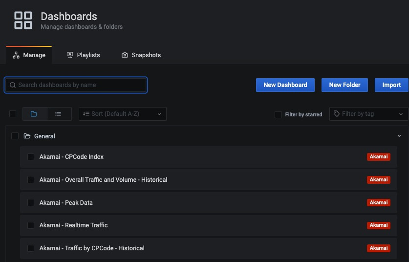
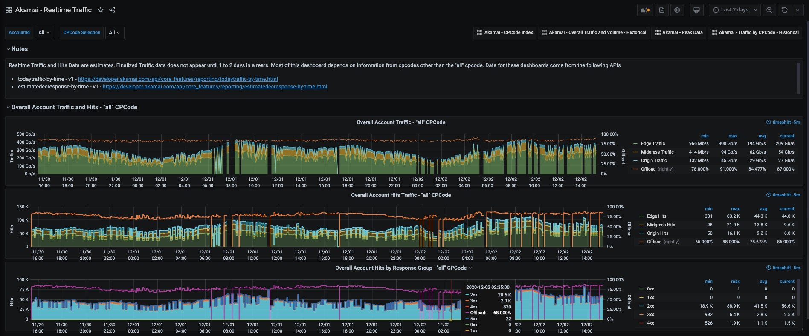
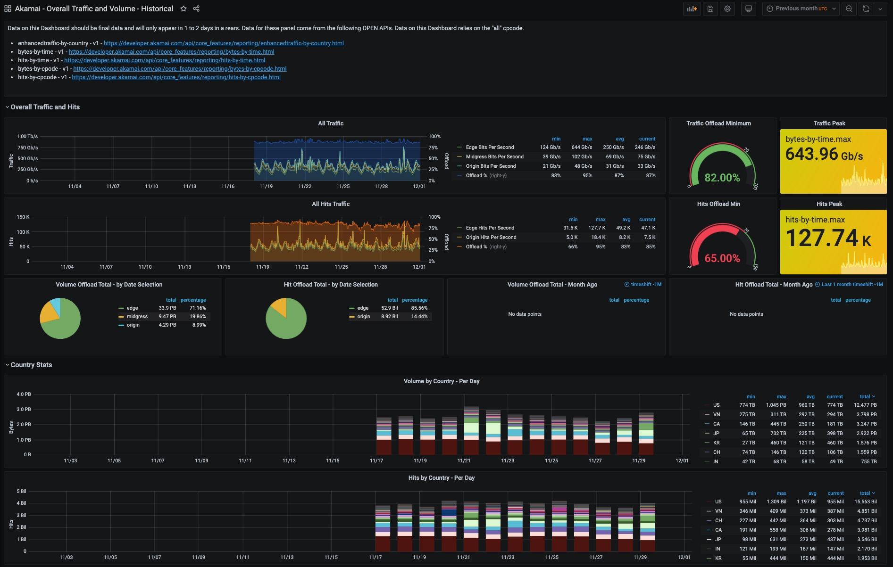

# akamai-telegraf
Akamai Telegraf Reporting API Docker Setup
Refer to dockerhub for docker instance: https://hub.docker.com/r/akatran/akamai-telegraf

This Telegraf instance includes custom configurations and plugins compatible with Akamai Reporting OPEN API

This akamai-telegraf container requires a valid **.edgerc** file in your home directory in the **[default]** section
```
cat ~/.edgerc
```

Example of what this should look like is as follows
```
[default]
client_secret = 123xxxxxxxxxxxxxxxxxxxxxxxxxxx=
host = akab-xxxxxxxxxxxxxxxxxxxx.luna.akamaiapis.net
access_token = akab-kxxxxxxxxxxxxxxxxxxxxxxxxx
client_token = akab-yogxxxxxxxxxxxxxxxxxxxxxxx
```

A single docker instance is probably not suitable for collecting more than 30 cpcodes worth of data

OPEN API credentials required are as follows: https://developer.akamai.com/getting-started/edgegrid
- Identity Management
  - read
- Contracts-API_Contracts
  - read
- CPcode and Reporting group (cprg)
  - read
- Reporting API
  - read/write
  
# How to use this

Clone the Git Repository
``` 
git clone https://github.com/akamai-tran/akamai-telegraf.git 
```
Edit the .env file
```
INFLUXDB_DB=telegraf
INFLUXDB_ADMIN_ENABLED=true
INFLUXDB_HTTP_AUTH_ENABLED=true
INFLUXDB_ADMIN_USER=admin
INFLUXDB_ADMIN_PASSWORD=supersecretpassword
INFLUXDB_USER=telegraf
INFLUXDB_USER_PASSWORD=secretpassword
ACCOUNTSWITCHKEY=
AKAMAI_ACCOUNT_ID=
ENABLED_CPCODES=all
```
create docker volumes ( so data persists across docker restarts )
```
$ for i in grafana influxdb; do docker volume create akamai-${i}-volume ; done
```

Run Docker Compose inside the folder of the cloned git repo
```
docker-compose up -d 
```

Navigate to grafana instance on your system
http://localhost:3000

Default username/password: admin/admin




# Important locations inside the akamai-telegraf container
- /tmp/AKAMAI
  - Where metrics are written as JSON when gathered, these are overwritten periodically as new metrics as gathered.
- /opt/akamai/telegraf
  - Where API scripts live
- /etc/telegraf
  - Where the telegraf configs and script that cron calls live
- /etc/cron.d/
  - where the cronjob settings live

# Backfilling Data

You can run these commands from the DOCKER HOST ( not inside the docker container )
to go backfill 30 days of data run the following - this will take an hour or more
```
docker exec akamai-telegraf /etc/telegraf/akamai_1d_30day_backfill
```
to backfill 90 days of data run the following - this will take several hours
```
docker exec akamai-telegraf /etc/telegraf/akamai_1d_90day_backfill
```
to backfill a variable range of days run the following - this will take time
```
docker exec akamai-telegraf /etc/telegraf/akamai_1d_backfill <daysago_start> <daysago_end>

Example of backfilling 3 to 5 days ago
docker exec akamai-telegraf /etc/telegraf/akamai_1d_backfill 3 5
```
